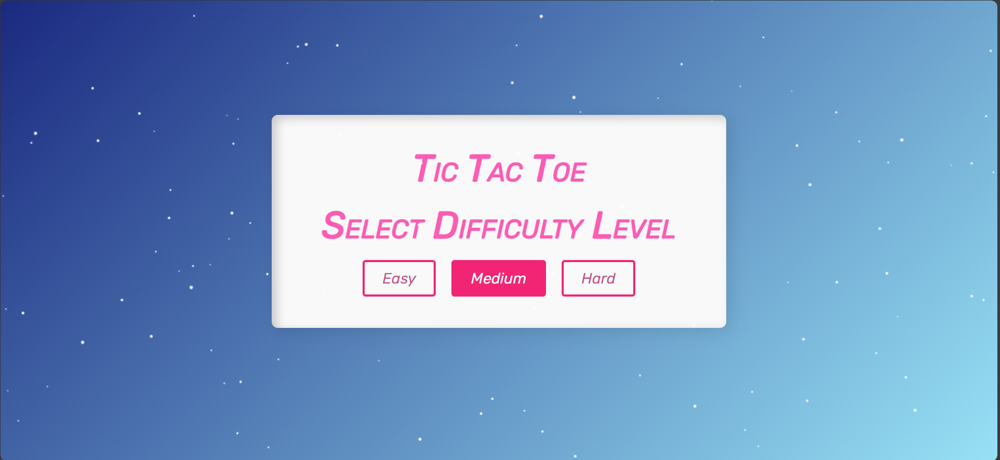
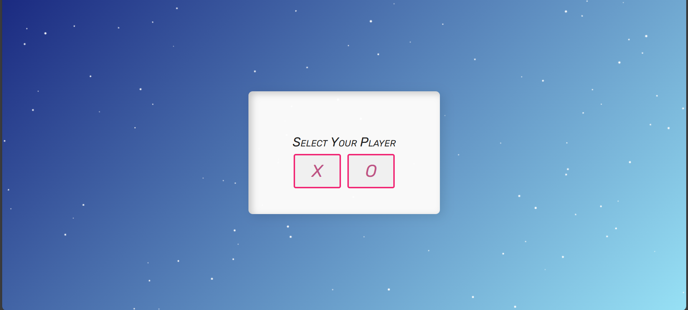
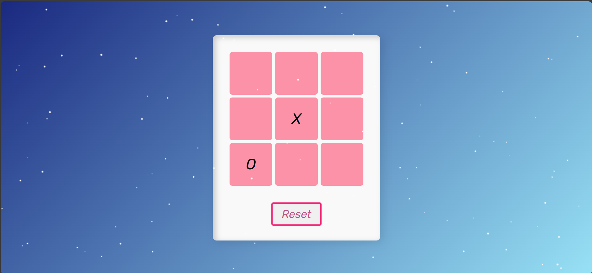
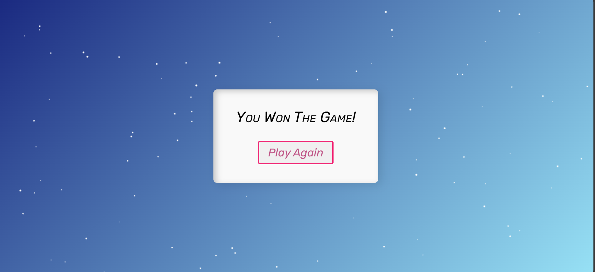

# 🎮 Tic Tac Toe Game

A modern, interactive **Tic Tac Toe game** built using **HTML, CSS, and JavaScript**, featuring multiple difficulty levels, smooth UI transitions, and an animated starry background.

This project focuses on clean UI, user experience, and intelligent gameplay using the **Minimax algorithm**.

---

## ✨ Features

- 🎯 Player vs Computer gameplay
- 🧠 Difficulty levels:
  - **Easy** – Random computer moves
  - **Medium** – Mix of random + smart moves
  - **Hard** – Unbeatable AI using Minimax
- 🌌 Animated starry background using HTML Canvas
- 🎨 Smooth fade-in / fade-out transitions
- 🏆 Winner highlight and draw detection
- 🔁 Reset & replay functionality
- 📱 Fully responsive for all screen sizes

---

## 🛠️ Tech Stack

- **HTML5** – Structure  
- **CSS3** – Styling, animations, responsiveness  
- **JavaScript (ES6)** – Game logic & AI  
- **Canvas API** – Animated background  

---

## 🧠 Game Logic

- The game uses the **Minimax algorithm** for Hard difficulty, making the computer unbeatable.
- Medium difficulty randomly alternates between Minimax and random moves.
- Easy difficulty uses purely random moves.
- Winning combinations are checked after every turn.
- Draw conditions are handled when no empty cells remain.

---
## Preview Game

